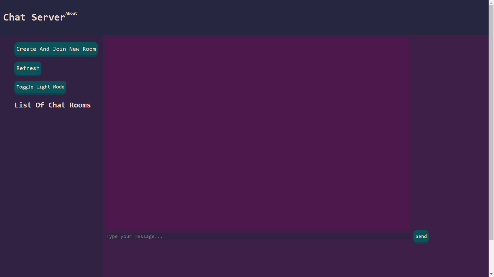
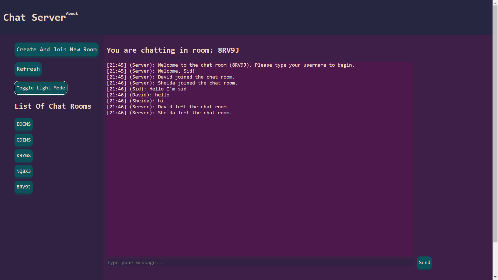
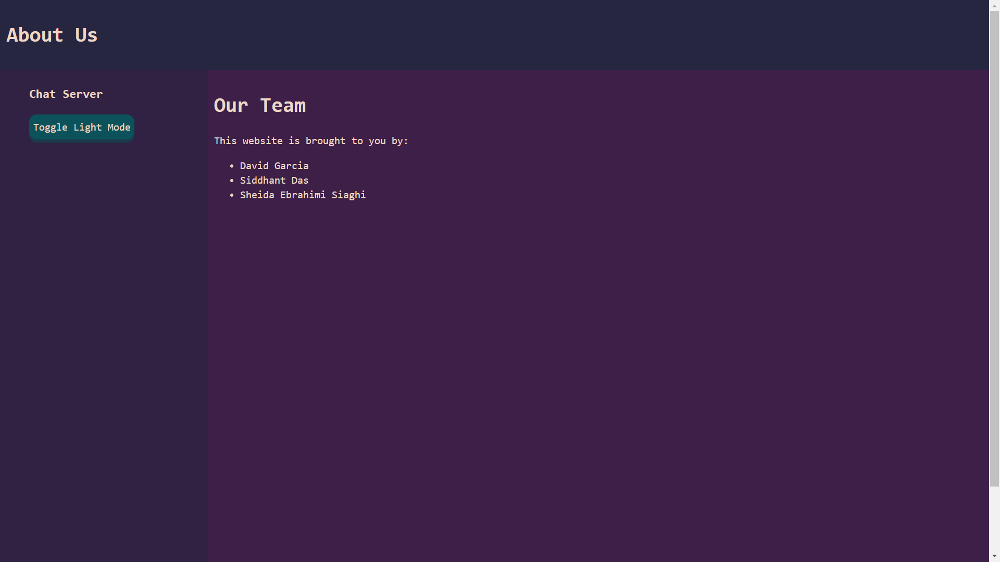
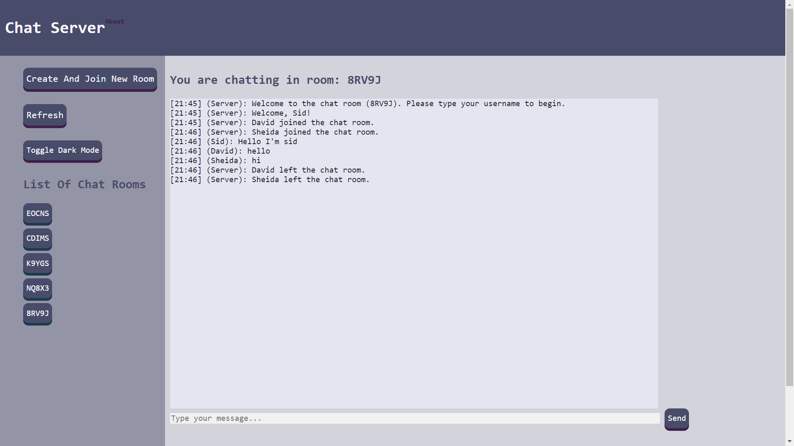

Web Chat Server (Instructions)
> Course: CSCI 2020U: Software Systems Development and Integration
###### *This was a university project, copying code not allowed*

## Authors
* #### [Siddhant Das](https://github.com/Sid-26)
* #### [Sheida Ebrahimi Siaghi](https://github.com/Sheida-Ebrahimi) 
* #### [David Garcia](https://github.com/garciadavid2000)

### How to run
The guide on how to run this project will be assuming the user is using Intellij IDEA and GlassFish 7.0.0.
- firstly clone the repo to your local computer
- open the repo in Intellij
- in the top right click the configuration drop down and 'Edit Configurations'
- click 'Add Configuration' and select GlassFish local 
- type domain1 into the domain entry box
- select the 'Deployment' tab and select `<repository name>:war exploded`
- the glassfish server has now been set up, and you can click the green arrow in the top right 
- this should automatically open a tab in your browser but if it does not then navigate to http://localhost:8080/WSChatServer-1.0-SNAPSHOT/

### How to use
Now that the server is running you should see a screen that looks like this

To create and join a chatroom, simply click the create and join new room button. This will prompt you for a username and notify to everybody
else in the room that you have joined. You can enter text into the text field by either typing text and pressing send or typing text and pressing 'enter'
on your keyboard. Now you can begin messaging. If another user wishes to use the same room, open another tab and paste http://localhost:8080/WSChatServer-1.0-SNAPSHOT/.
If the room the first user is in does not show up in the list of chat rooms, simply press the refresh button under the join room button and then click the button that appears to join
the room. This will repeat the username setting process and now both users should be able to talk to each other. This process can be repeated by creating more chat rooms
and swapping between rooms at the user's will. A notification will be sent to everybody else in a room whenever a user leaves and a set username prompt will always be shown
when entering a room.

Here is an example of what it would look like to use our application

There is also an About Us page you can see if you click `About` in the top left

Clicking on our names takes you to our respective GitHub pages and clicking 'Chat Server' in the top left takes you back to the main chatting page.

### Project Improvements
The most notable improvement we made was our user interface. We have implemented a beautiful interface that is easy on the eyes,
and you can even toggle between dark and light mode. Here is an example of the light mode interface.

Another improvement we made involves the creation of `RoomServlet.java`. This class handles a `GET` request from the client and sends a list of current active
rooms in the form of a `JSON`. This aids the `refresh()` function in the `main.js` file which updates the list of rooms for all the clients.
We also added room switching functionality so users can switch between rooms and communicate with users already in those rooms.

[//]: # (We also implemented a Chat History functionality which displays the history of chat rooms when a new user joins.)

### External Resources
The main dependencies we used for this project were `jakarta` for websockets and `org.json` for parsing `JSON` files on the server side.
All the dependencies are listed in the `pom.xml` file which is in the root directory of the repository, and they have their relevant website links commented above them.
